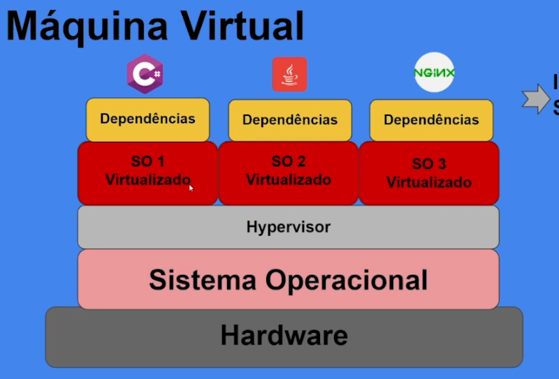
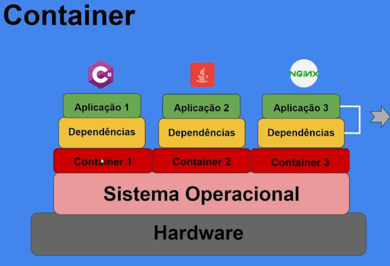
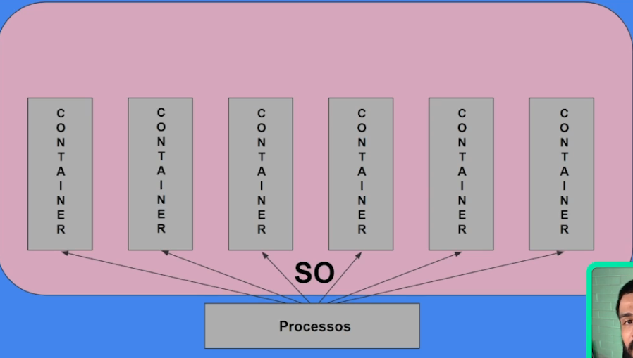
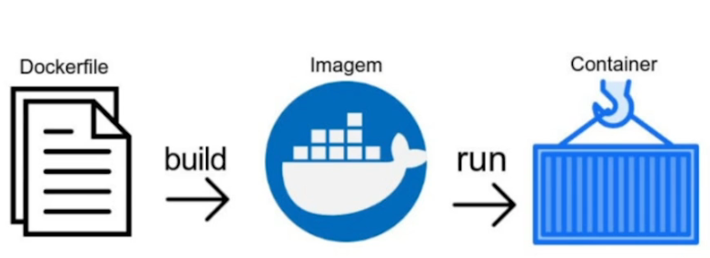

# Docker

---

> O Docker é uma tecnologia de virtualização de contêineres que permite empacotar aplicativos e suas dependências em unidades isoladas, chamadas contêineres, para facilitar o desenvolvimento, implantação e escalabilidade de aplicativos de forma eficiente e portátil. Isso ajuda a garantir a consistência, eficiência e portabilidade dos aplicativos em diferentes ambientes de implantação.

----

## Contêiners

> Um contêiner, no contexto de tecnologia de contêineres como o Docker, é uma unidade leve e isolada que contém um aplicativo, suas dependências e todo o ambiente necessário para que o aplicativo seja executado de maneira consistente em diferentes sistemas e ambientes.
>
> Esses contêineres são baseados em uma tecnologia de virtualização de nível de sistema operacional que isola processos e recursos do sistema, permitindo que vários contêineres compartilhem o mesmo sistema operacional host. Cada contêiner inclui sua própria pilha de sistema de arquivos, bibliotecas e configurações, tornando-o independente e auto-suficiente.
>
> ### Maquina virtual:
>
> 
>
> ---
>
> ### Containers:
>
> 
>
> 
>
> ---
>
> ### Namespaces
>
> Um namespace é um recurso do kernel Linux usado para isolar e encapsular processos e recursos de sistema. Essa tecnologia é fundamental para a implementação de containers, pois permite que diferentes containers compartilhem o mesmo kernel, mas operem de forma isolada. Os namespaces ajudam a criar um ambiente mais seguro e eficiente para a execução de aplicativos em contêineres. Aqui estão alguns dos namespaces principais utilizados pelo Docker:
>
> 1. **Namespace de Processos (PID):**
>    - **Objetivo:** Isola o espaço de processos, de modo que os processos em um namespace PID não podem ver ou interferir nos processos fora desse namespace.
>    - **Docker Option:** `--pid`
> 2. **Namespace de Rede (NET):**
>    - **Objetivo:** Isola a pilha de rede, permitindo que cada contêiner tenha seu próprio conjunto de interfaces de rede, tabelas de roteamento e firewalls.
>    - **Docker Option:** `--net`
> 3. **Namespace de Sistema de Arquivos (MNT):**
>    - **Objetivo:** Isola os sistemas de arquivos, permitindo que cada contêiner tenha seu próprio sistema de arquivos raiz.
>    - **Docker Option:** `--mount` ou `-v` (para montar volumes)
> 4. **Namespace de Hostname (UTS):**
>    - **Objetivo:** Isola o hostname do contêiner, fornecendo a ilusão de um host independente para cada contêiner.
>    - **Docker Option:** `--hostname`
> 5. **Namespace de Usuário (USER):**
>    - **Objetivo:** Isola os IDs de usuário e grupo, permitindo que um contêiner tenha seus próprios intervalos de IDs de usuário.
>    - **Docker Option:** `--user`
> 6. **Namespace de IPC (Inter-Process Communication):**
>    - **Objetivo:** Isola as estruturas de IPC, como filas de mensagens e semáforos, proporcionando isolamento entre contêineres.
>    - **Docker Option:** `--ipc`
> 7. **Namespace de Dispositivos (DEV):**
>    - **Objetivo:** Isola o acesso a dispositivos, restringindo quais dispositivos o contêiner pode acessar.
>    - **Docker Option:** `--device`
> 8. **Namespace de Cgroups (CGROUP):**
>    - **Objetivo:** Isola os recursos do sistema, como CPU, memória e dispositivos de E/S, usando control groups (cgroups).
>    - **Docker Option:** As opções relacionadas a cgroups são gerenciadas implicitamente pelo Docker.
>
> Volumes 
>
> ### Cgroup
>
> Cgroups (Control Groups) são uma funcionalidade no kernel Linux que permite a alocação, controle e monitoramento de recursos do sistema, como CPU, memória e I/O, entre grupos de processos. Essa tecnologia é crucial para a implementação de contêineres, permitindo a criação de ambientes isolados e a definição de limites de recursos para garantir eficiência e segurança. No contexto do Docker, cgroups são usados para controlar e limitar os recursos consumidos por cada contêiner.

----

## DockerHub

> O Docker Hub é um serviço da Docker que funciona como um registro centralizado para imagens de contêineres. Ele permite o armazenamento, compartilhamento e distribuição de imagens Docker, tanto públicas quanto privadas. Os desenvolvedores usam o Docker Hub para colaborar, acessar imagens prontas, e integrar facilmente suas aplicações em contêineres a diferentes ferramentas e serviços.
>
> ### Subindo imagens
>
> ```bash
> docker login u- <usuario>
> docker push <iamgen>:<tag>
> ```
>
> 


-----

## Comandos Uteis

> - ***docker ps*** ou ***docker container ls*** => Exibe quais conteiners estão em execucao.
> - ***docker ps -s*** => Exibe o tamanho do container juntamente os as inforamcoes do ps, tamanho da imagem + cabada de escrita.
> - ***docker ps -a*** ou ***docker container ls -a*** => Exibe todos os conteiners (ativos ou nao).
> - ***docker pull <imagem>*** => Baixa a inagem do dockerHub.
> - ***docker stop <nome ou id container>*** => Para a execucao do container resetando todos os processos.
> - ***docker stop -t=0 <nome ou id container>*** => Para a execucao do container estantaneamente resetando todos os processos.
> - ***docker  pause <nome ou id container>*** => Para a execucao do container mas mantem todos os processos.
> - ***docker  unpause <nome ou id container>*** => Volta a execucao do container.
> - ***docker start <nome container>*** =>  Execuca o container.
> - ***docker stop $(docker ps -q)*** => Para parar todos os contêineres em execução.
> - ***docker rm $(docker ps -aq)*** => Para remover todos os contêineres (parados e em execução) 
> - ***docker rmi $(docker image ls  -aq)*** => Para remover todos as imagens
> - ***docker exec -it <id no container> <comando>*** => Para interagir com o containers de forma interativa. (O `docker run` cria um novo container e o executa. O `docker exec` permite executar um comando em um container que já está em execução.)
> - ***docker run -it <iamgem> bash*** => Para subir o container e já executar o bash interativo.
> - ***docker run -d <iamgem>*** => Executa a imagem e deixa rodando por baixo em detached.
> - ***docker run -d -P <iamgem>*** => basicamente, este comando executa um contêiner em segundo plano e mapeia automaticamente as portas do contêiner para portas disponíveis no host.
> - ***docker  port <id>*** => Exibe o mapeamento de portas em relacao ao host.
> - ***docker run -d -p 8080::80 <iamgem>*** => Configura um mapeamento de uma porta do container para uma do host.
> - **docker inspect <imageId>** => Mostra meta dados da imagem.
> - **docker history <imageId>** => Mostra todas as camadas da imagem.
> - **docker build -t**  <nome> **:**<versao> <contexto que vai executada (diretorio)> => Buildar o dockerfile para construir uma nova imagem.
> - **docker volume ls:** Para ver os volumes criados.
> - **docker network ls:** Lista as redes no sistema.
> - **docker run -it --name <nome>  <imagem> bash:** Roda uma imagem docker com nome setado.
> - **docker network create --direve <drive> <nome>:** Cria uma rede.
> - **docker run -it --name <nome> --network <nome>  <imagem> bash:** Roda uma imagem docker com nome setado e na rede setada.
> - **docker-compose down  <nome>:** Derruba um servico.
> - **docker-compose up  <nome>:** Sobe um servico.
> - **docker-compose up -d  <nome>:** Sobe um servico detached.
> - **docker-compose ps  :** Lista os servicos.
>


----

## Image

> Uma imagem Docker é um pacote autossuficiente que contém um aplicativo ou serviço juntamente com todas as dependências necessárias para executá-lo. Essas imagens são a base da tecnologia de contêineres, que é usada para empacotar e distribuir aplicativos de forma consistente e portátil.
>
> Uma imagem Docker é construída a partir de camadas. Cada camada representa uma etapa no processo de construção da imagem e contém um conjunto específico de arquivos e configurações. As camadas são empilhadas umas sobre as outras para criar a imagem final. Isso permite o compartilhamento eficiente de recursos entre diferentes imagens e a reutilização de camadas comuns.
>
> Aqui estão algumas informações adicionais sobre camadas em imagens Docker:
>
> 1. **Camada Base (Base Layer)**: A camada base é a primeira camada de uma imagem Docker e contém o sistema operacional ou sistema de arquivos base. Pode ser uma distribuição Linux mínima ou uma imagem específica do sistema operacional que serve como ponto de partida.
> 2. **Camadas Intermediárias (Intermediate Layers)**: As camadas intermediárias são criadas durante o processo de construção da imagem e contêm as dependências, bibliotecas e aplicativos específicos necessários para o aplicativo que está sendo empacotado. Cada instrução no Dockerfile (o arquivo de configuração que descreve como a imagem é construída) gera uma nova camada intermediária.
> 3. **Camada de Imagem Final (Final Image Layer)**: A camada final contém os arquivos e configurações específicos do aplicativo que estão sendo empacotados. Essa camada é criada quando o processo de construção da imagem é concluído.
>
> As camadas são armazenadas em cache e podem ser compartilhadas entre imagens. Isso significa que se você estiver construindo várias imagens que compartilham algumas das mesmas dependências, as camadas comuns serão reutilizadas, economizando espaço em disco e acelerando o processo de construção.
>
> É importante notar que as imagens Docker são imutáveis, o que significa que, uma vez criadas, suas camadas não podem ser alteradas. Se você fizer alterações no aplicativo ou em suas dependências, você deve criar uma nova imagem com as alterações e, se possível, reutilizar as camadas existentes para manter a eficiência.
>
> 

---

## Dockerfile

> Dockerfile é um arquivo de configuração usado para criar uma imagem Docker. O Docker é uma plataforma de virtualização de contêiner que permite que você empacote aplicativos e suas dependências em contêineres, que podem ser executados em qualquer ambiente que suporte o Docker.
>
> Um Dockerfile contém um conjunto de instruções que descrevem como uma imagem Docker deve ser construída. Essas instruções incluem coisas como a imagem de base a ser usada, os comandos a serem executados para configurar o ambiente, as dependências a serem instaladas e os arquivos a serem copiados para o contêiner.
>
> ```dockerfile
> FROM node:14
> WORKDIR /app-node
> ARG PORT_BUILD=600 #tempo de build da imagem
> ENV PORT=$PORT_BUILD #variavel de ambiente
> EXPOSE $PORT_BUILD #expoe a porta a ser utilizada
> COPY . .
> RUN npm install
> ENTRYPOINT npm start
> ```
>

----

## Storage

> ## **Bind mounts**
>
> > São links entre uma pasta existente no sistema hospedeiro e uma pasta dentro do contêiner Docker. Isso significa que o conteúdo da pasta no sistema hospedeiro é acessível dentro do contêiner. Alterações feitas em qualquer lado (no sistema hospedeiro ou no contêiner) são refletidas imediatamente no outro
> >
> > Criar um bind mount
> >
> > ```bash
> > docker run -it --mount type=bind,source=/home/user/volumedocker,target=/app ubuntu bash
> > ```
> >
> > 
>
> ----
>
> ## Volumes
>
> > Ssão armazenamentos persistentes usados pelo Docker. Eles são gerenciados pelo Docker e estão localizados em um local específico no sistema hospedeiro. Volumes são independentes do ciclo de vida do contêiner, o que significa que persistem mesmo quando o contêiner não está em execução.
> >
> > Volumes gerenciados pelo docker armazenados em (/var/lib/dcoker/volumes)
> >
> > ```bash
> > docker run -it -v volumedocker:/app ubuntu bash
> > 
> > docker run -it --mount source=meunovovolume,target=/app ubuntu bash
> > ```
> >
> > 
>
> ----
>
> ## TMPFS
>
> > TMPFS é um sistema de arquivos temporário baseado em memória RAM. No contexto do Docker, você pode usar TMPFS para criar um sistema de arquivos temporário na memória para um contêiner.
> >
> > Ao criar um contêiner Docker, é possível montar um sistema de arquivos TMPFS em um diretório dentro do contêiner. Isso é útil para armazenar dados temporários que não precisam ser persistidos no disco.
> >
> > Por exemplo, para montar um sistema TMPFS em um diretório dentro do contêiner, você pode usar o seguinte comando:
> >
> > ```bash
> > docker run -it --mount type=tmpfs, destination=/app ubuntu bash
> > ```
>
> ----
>

## Redes

> Redes no Docker são essenciais para conectar e isolar contêineres, permitindo a comunicação entre eles e com recursos externos. Existem diferentes tipos de redes, como Bridge, Host, Overlay e Macvlan, cada uma com usos específicos.
>
> ### Drivers
>
> > ### Bridge
> >
> > > A rede padrão do Docker é chamada de "bridge network". Ela permite que os containers se comuniquem entre si e com o host usando endereços IP dentro de uma rede virtual, facilitando a interação e o compartilhamento de informações. Essa rede oferece isolamento e é a base para a comunicação entre os containers, sendo criada automaticamente durante a instalação do Docker.
> >
> > **Host**
> >
> > > O driver de rede "host" no Docker permite que um container compartilhe diretamente a pilha de rede do sistema operacional hospedeiro. Dessa forma, o container acessa recursos e serviços do host sem a camada de abstração da rede do Docker. Isso proporciona desempenho de rede similar ao do próprio host, mas pode apresentar riscos de segurança ao expor mais o container à rede do host.
> >
> > **None**
> >
> > > Nenhum drive. Remove a interface de rede.
>
> ---
>

## Docker Compose (Composicao e cordenacao de containers)

> O Docker Compose é uma ferramenta que simplifica a execução de aplicativos Docker compostos por múltiplos contêineres. Ele utiliza um arquivo de configuração YAML para definir serviços, redes e volumes, facilitando o gerenciamento e a orquestração desses contêineres. Isso torna mais eficiente o desenvolvimento, teste e implementação de aplicativos complexos.

