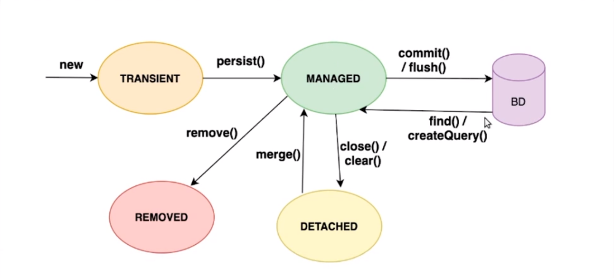

# Java-JPA

---

## Motivacao para o desenvolvimento do JPA

> Alto o acoplamento de código JDBC, e verbosidade da sua escrita.

---

## ORM

> ORM (Object-Relational Mapping) em Java é uma técnica que permite mapear objetos Java para tabelas em um banco de dados relacional, facilitando a persistência e recuperação de dados. Em vez de escrever consultas SQL manualmente, o ORM Java cuida da tradução entre os objetos Java e o esquema do banco de dados.

---

## JPA

> A especificação JPA define um conjunto de anotações e APIs que permitem aos desenvolvedores mapear objetos Java para tabelas em um banco de dados relacional de forma transparente. Ela oferece uma abordagem baseada em metadados, onde as informações de mapeamento podem ser definidas usando anotações nas classes de entidade ou por meio de arquivos de mapeamento XML.
>
> Que possui varias implementacoes como o Hibernet.

----

## Hibernet

> Hibernate é um framework ORM (Object-Relational Mapping) popular e amplamente utilizado em Java. Ele fornece uma implementação da especificação JPA (Java Persistence API) e oferece recursos avançados para mapeamento objeto-relacional, gerenciamento de transações e persistência de dados em aplicativos Java.

---

## Persistence.xml

> **META-INF > persistence.xml**
>
> ```xml
> <?xml version="1.0" encoding="UTF-8"?>
> <persistence version="2.2"
>  xmlns="http://xmlns.jcp.org/xml/ns/persistence"
>  xmlns:xsi="http://www.w3.org/2001/XMLSchema-instance"
>  xsi:schemaLocation="http://xmlns.jcp.org/xml/ns/persistence http://xmlns.jcp.org/xml/ns/persistence/persistence_2_2.xsd"
> >
>  <persistence-unit name="banco-test" transaction-type="RESOURCE_LOCAL || JTA">
> 
> 		    <properties>
>              <property name="javax.persistence.jdbc.driver" value="classe do driver do DB"/>
>              <property name="javax.persistence.jdbc.url" value="URL de conexao DB"/>
>              <property name="javax.persistence.jdbc.user" value="user"/>
> 				<property name="javax.persistence.jdbc.password" value="password"/>
>              <property name="hibernate.dialect" value="dialeto do DB"/>
>          </properties>
> 
> 	</persistence-unit>
> 
> </persistence>
> ```
>
> ----
>
> ```xml
> <property name="hibernate.hbm2ddl.auto">update</property>
> ```
>
> A propriedade `hibernate.hbm2ddl.auto` é usada para configurar o comportamento do Hibernate ao gerar ou atualizar o esquema do banco de dados com base nas definições de mapeamento de entidades.
>
> Aqui estão algumas opções de configuração comuns para `hibernate.hbm2ddl.auto`:
>
> - `none`: Essa é a opção padrão. O Hibernate não fará nenhuma alteração no esquema do banco de dados.
> - `create`: O Hibernate criará um novo esquema do banco de dados toda vez que a aplicação for iniciada, descartando o esquema existente se necessário.
> - `create-drop`: O Hibernate criará um novo esquema do banco de dados quando a aplicação for iniciada e o descartará quando a aplicação for encerrada.
> - `update`: O Hibernate verificará o esquema do banco de dados em relação às definições de mapeamento de entidades e fará as alterações necessárias para garantir a correspondência. Isso pode envolver a criação de novas tabelas, colunas ou restrições, ou a exclusão de entidades ou colunas não mais utilizadas.
> - `validate`: O Hibernate verificará o esquema do banco de dados em relação às definições de mapeamento de entidades e emitirá um aviso se houver alguma inconsistência.

----

## Mapeamento

> Exemplo segue com a sequence do postgrees:
>
> ```java
> import javax.persistence.*;
> 
> @Entity
> @Table(name = "products")
> public class Product {
> 
>  @Id
>  @GeneratedValue(strategy = GenerationType.SEQUENCE, generator = "product_sequence")
>  @SequenceGenerator(name = "product_sequence", sequenceName = "product_seq", allocationSize = 1)
>  private Long id;
> 
>  @Column(name = "name")
>  private String name;
> 
>  @Column(name = "price")
>  private double price;
> 
>  // Construtores, getters e setters
> }
> 
> ```
>
> ---
>
> ```java
> import javax.persistence.*;
> 
> @Entity
> @Table(name = "categories")
> public class Category {
> 
>  @Id
>  @GeneratedValue(strategy = GenerationType.SEQUENCE, generator = "categories_sequence")
>  @SequenceGenerator(name = "categories_sequence", sequenceName = "categories_seq", allocationSize = 1)
>  private Long id;
> 
>  @Column(name = "name")
>  private String name;
> 
>  // Construtores, getters e setters
> }
> 
> ```
>
> ----
>
> 1. @OneToOne:
>    - A anotação `@OneToOne` é usada para mapear um relacionamento um-para-um entre duas entidades. Ela pode ser colocada em uma propriedade que representa a associação entre as entidades. É possível especificar parâmetros como `mappedBy` e `cascade` para controlar o comportamento da associação.
> 2. @OneToMany:
>    - A anotação `@OneToMany` é usada para mapear um relacionamento um-para-muitos entre duas entidades. Ela pode ser colocada em uma propriedade que representa a associação entre as entidades. É possível especificar parâmetros como `mappedBy` e `cascade` para controlar o comportamento da associação.
> 3. @ManyToOne:
>    - A anotação `@ManyToOne` é usada para mapear um relacionamento muitos-para-um entre duas entidades. Ela pode ser colocada em uma propriedade que representa a associação entre as entidades. É possível especificar parâmetros como `fetch` e `cascade` para controlar o comportamento da associação.
> 4. @ManyToMany:
>    - A anotação `@ManyToMany` é usada para mapear um relacionamento muitos-para-muitos entre duas entidades. Ela pode ser colocada em uma propriedade que representa a associação entre as entidades. É necessário definir uma tabela de associação intermediária para armazenar os pares de chaves estrangeiras correspondentes.
>
> *ToOne acabam sempre carregando todos fazendo um join
>
> 

---

## EntityManager

> É uma interface da API de Persistência do JPA (Java Persistence API) que fornece funcionalidades para gerenciar entidades em um contexto de persistência. O JPA é uma especificação Java que define uma interface comum para mapeamento objeto-relacional e operações de banco de dados usando tecnologias de persistência, como o Hibernate.
>
> O `EntityManager` é responsável por várias tarefas, incluindo:
>
> 1. Gerenciamento do ciclo de vida das entidades: O `EntityManager` permite persistir, atualizar, recuperar e excluir entidades. Ele rastreia as mudanças feitas nas entidades e as sincroniza com o banco de dados quando a transação é confirmada.
> 2. Consultas de banco de dados: O `EntityManager` oferece métodos para executar consultas em JPQL (Java Persistence Query Language), uma linguagem de consulta orientada a objetos que se assemelha ao SQL. Isso permite que você recupere entidades com base em critérios específicos.
> 3. Controle de transações: O `EntityManager` gerencia transações, permitindo que você inicie, comite ou reverta transações. Isso garante a integridade dos dados ao realizar operações de persistência.
> 4. Cache de entidades: O `EntityManager` possui um cache de primeiro nível, também conhecido como cache de entidades, que armazena as entidades carregadas do banco de dados. Isso melhora o desempenho, evitando consultas repetidas ao banco de dados para entidades já carregadas.

----

## Clico de vida das entidades

> 

-----

## Operations

> ```java
> EntityManager entityManager = entityManagerFactory.createEntityManager();
> EntityTransaction transaction = null;
> 
> 
> // Busca
> Product product = entityManager.find(Product.class, 1L);
> 
> transaction = entityManager.getTransaction();
> 
> //Inserção
> Product product = new Product();
> product.setName("Novo Produto");
> product.setPrice(29.99);
> 
> entityManager.persist(product);
> 
> // Atualização
> product.setPrice(19.99);
> entityManager.merge(product);
> 
> transaction.commit();
> 
> // Exclusão
> transaction = entityManager.getTransaction();
> transaction.begin();
> 
> entityManager.remove(product);
> 
> transaction.commit();
> 
> entityManager.close();
> ```
>
> 1. `begin()`: Esse método inicia uma nova transação. É usado para marcar o início de uma unidade lógica de trabalho (ou seja, uma operação que será tratada como uma transação).
> 2. `commit()`: Esse método confirma a transação atual. Ele efetiva todas as alterações feitas durante a transação no banco de dados. Após o `commit()`, as alterações se tornam permanentes e visíveis para outras transações.
> 3. `detach()`: Esse método remove uma entidade do contexto de persistência. Quando uma entidade é desanexada, ela não é mais gerenciada pelo `EntityManager`. Quaisquer alterações feitas na entidade após o `detach()` não serão sincronizadas com o banco de dados, a menos que a entidade seja reanexada.
> 4. `flush()`: Esse método sincroniza o estado do `EntityManager` com o banco de dados. Todas as alterações pendentes (modificações, exclusões, inserções) são enviadas ao banco de dados e refletidas imediatamente. Após o `flush()`, as alterações são visíveis para outras transações.
> 5. `merge()`: Esse método atualiza o estado de uma entidade no contexto de persistência. Ele é usado para mesclar as alterações de uma entidade desanexada (ou seja, uma entidade que não está sendo gerenciada pelo `EntityManager`) com uma entidade persistente. O `merge()` retorna uma referência à entidade gerenciada atualizada.
> 6. `persist()`: Esse método persiste uma nova entidade no banco de dados. Ele é usado para inserir uma nova entidade no contexto de persistência e no banco de dados. Após o `persist()`, a entidade se torna gerenciada pelo `EntityManager`.
> 7. `remove()`: Esse método remove uma entidade do banco de dados. Ele marca a entidade para exclusão. Quando a transação é confirmada, a entidade será removida permanentemente do banco de dados.
> 8. `clear()`: O método `clear()` é um método da classe `EntityManager` no Hibernate. Ele é usado para limpar o contexto de persistência, removendo todas as entidades gerenciadas do contexto. Isso significa que todas as entidades em cache serão desanexadas e o estado do `EntityManager` será limpo.
> 9. `find()`: O método `find()` é usado para buscar uma entidade pelo seu identificador no banco de dados. Ele é um método da classe `EntityManager` e permite a recuperação de uma entidade específica com base no seu tipo e identificador.

-----

## JPQL (Java Persistence Query Language)

> é uma linguagem de consulta orientada a objetos semelhante ao SQL, usada para executar consultas em entidades gerenciadas pelo JPA (Java Persistence API), que é uma especificação de persistência de dados em Java.
>
> A JPQL permite que você faça consultas em objetos de domínio usando suas propriedades e relacionamentos, em vez de consultar diretamente o banco de dados com SQL. Ela é independente do banco de dados subjacente e permite escrever consultas de forma mais orientada a objetos.
>
> ```java
> String jpql = "SELECT p FROM Product p WHERE p.price > :priceThreshold";
> EntityManager entityManager = entityManagerFactory.createEntityManager();
> 
> try {
>  TypedQuery<Product> query = entityManager.createQuery(jpql, Product.class);
>  query.setParameter("priceThreshold", 50.0);
> 
>  List<Product> products = query.getResultList();
> 
>  for (Product product : products) {
>      System.out.println("Nome do produto: " + product.getName() + ", Preço: " + product.getPrice());
>  }
> } catch (Exception e) {
>  e.printStackTrace();
> } finally {
>  entityManager.close();
> }
> 
> ```
>
> ---
>
> É possivel fazer com sequencia também
>
> ```java
> String jpql = "SELECT p FROM Product p WHERE p.price > ?1 ORDER BY p.price DESC";
> EntityManager entityManager = entityManagerFactory.createEntityManager();
> 
> try {
>  TypedQuery<Product> query = entityManager.createQuery(jpql, Product.class);
>  query.setParameter(1, 50.0);
> 
>  List<Product> products = query.getResultList();
> 
>  for (Product product : products) {
>      System.out.println("Nome do produto: " + product.getName() + ", Preço: " + product.getPrice());
>  }
> } catch (Exception e) {
>  e.printStackTrace();
> } finally {
>  entityManager.close();
> }
> ```
>
> ----
>
> Também é possivel instanciar e retornar objetos com o valor das colunas da query
>
> ```java
> String jpqlQuery = "SELECT NEW com.example.Person(p.name, p.age) FROM Person p WHERE p.age > :age";
> 
> TypedQuery<Person> query = entityManager.createQuery(jpqlQuery, Person.class);
> query.setParameter("age", 18);
> 
> List<Person> results = query.getResultList();
> ```
>
> ----
>
> ### @NamedQuery
>
> Ao usar consultas nomeadas, você pode centralizar e reutilizar consultas comumente usadas em suas entidades JPA.
>
> ```java
> import javax.persistence.Entity;
> import javax.persistence.GeneratedValue;
> import javax.persistence.GenerationType;
> import javax.persistence.Id;
> import javax.persistence.NamedQuery;
> 
> @Entity
> @NamedQuery(name = "Pessoa.encontrarPorIdadeMaiorQue", query = "SELECT p FROM Pessoa p WHERE p.idade > :idade")
> public class Pessoa {
>     @Id
>     @GeneratedValue(strategy = GenerationType.IDENTITY)
>     private Long id;
>     
>     private String nome;
>     private int idade;
>     
>     // Construtor, getters, setters e outros códigos...
> }
> 
> TypedQuery<Pessoa> query = entityManager.createNamedQuery("Pessoa.encontrarPorIdadeMaiorQue", Pessoa.class);
> query.setParameter("idade", 18);
> 
> List<Pessoa> resultados = query.getResultList();
> 
> ```
>
> 

----

## Relacioanmento bidirecional

> E uma associação entre duas entidades em que ambas têm conhecimento da existência uma da outra. Isso permite navegar e acessar as entidades de ambos os lados do relacionamento.
>
> Aqui está um exemplo de relacionamento bidirecional entre as entidades `Product` e `Category`, onde um produto pode pertencer a várias categorias e uma categoria pode ter vários produtos:
>
> ```java
> @Entity
> public class Product {
>     @Id
>     @GeneratedValue(strategy = GenerationType.IDENTITY)
>     private Long id;
> 
>     private String name;
> 
>     @ManyToMany(mappedBy = "products", cascade = CascadeType.ALL)
>     private List<Category> categories = new ArrayList<>();
> 
>     // Getters e Setters
> }
> 
> ```
>
> ```java
> @Entity
> public class Category {
>     @Id
>     @GeneratedValue(strategy = GenerationType.IDENTITY)
>     private Long id;
> 
>     private String name;
> 
>     @ManyToMany
>     private List<Product> products = new ArrayList<>();
> 
>     // Getters e Setters
> }
> 
> ```
>
> No exemplo acima, o relacionamento bidirecional é estabelecido usando a anotação `@ManyToMany` nas duas entidades. A entidade `Product` possui uma lista de categorias (`categories`) e a entidade `Category` possui uma lista de produtos (`products`).
>
> O atributo `mappedBy = "products"` na anotação `@ManyToMany` na classe `Product` indica que a propriedade `products` na classe `Category` é responsável por mapear o relacionamento. Isso define que a classe `Category` é a proprietária do relacionamento.
>
> ### Propriedade cascade
>
> 1. `CascadeType.PERSIST`: A operação de persistência (salvar) será propagada para os objetos associados. Isso significa que quando você salvar um objeto principal, os objetos associados também serão salvos automaticamente.
> 2. `CascadeType.MERGE`: A operação de mesclagem (atualizar) será propagada para os objetos associados. Isso significa que quando você atualizar um objeto principal, as alterações nos objetos associados também serão mescladas automaticamente.
> 3. `CascadeType.REMOVE`: A operação de remoção (excluir) será propagada para os objetos associados. Isso significa que quando você excluir um objeto principal, os objetos associados também serão excluídos automaticamente.
> 4. `CascadeType.ALL`: Todas as operações de persistência (salvar, atualizar, excluir) serão propagadas para os objetos associados.
>
> 

