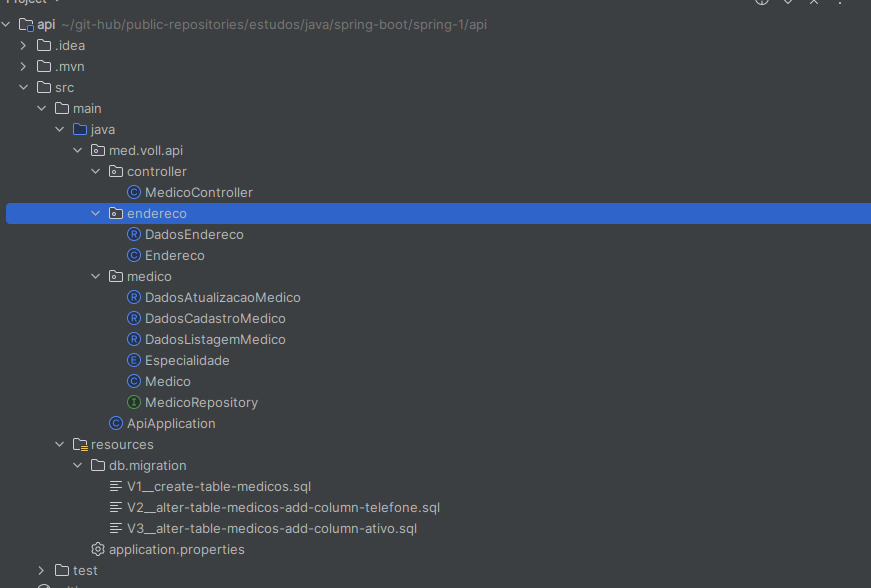

# API SPRING BOOT #1

-----

## Objetivo

> - Desenvolimento de uma API REST
> - CRUD
> - Validacoes
> - Paginacao e ordenacao

----

## Tecnologias

> - Spring Boot 3
> - Java 17
> - Lombok
> - MySQL / Flyway
> - JPA / HIBERNATE
> - Maven

---

## Inicializar configuracao do spring 

> https://start.spring.io/

----

## Anotacoes

> 
>
> ```txt
> >controller
> 	>End poits e metodos
> >medico
> 	>Entidade
> 	>Dtos
> 	>Repository (Metodos de manipulacao de BD)
> >db/migrations
> 	>Versionamento de bancp de dados (Arquivos SQL)
> ```
>
> 

----

## Responses

> | Código | Significado en Inglés   | Significado em Português |
> | ------ | ----------------------- | ------------------------ |
> | 1xx    | Informational Responses | Respostas Informativas   |
> | 100    | Continue                | Continuar                |
> | 101    | Switching Protocols     | Mudança de Protocolo     |
> | 2xx    | Successful Responses    | Respostas Bem-Sucedidas  |
> | 200    | OK                      | OK                       |
> | 201    | Created                 | Criado                   |
> | 204    | No Content              | Sem Conteúdo             |
> | 3xx    | Redirections            | Redirecionamentos        |
> | 300    | Multiple Choices        | Múltipla Escolha         |
> | 301    | Moved Permanently       | Movido Permanentemente   |
> | 304    | Not Modified            | Não Modificado           |
> | 4xx    | Client Errors           | Erros do Cliente         |
> | 400    | Bad Request             | Solicitação Inválida     |
> | 401    | Unauthorized            | Não Autorizado           |
> | 403    | Forbidden               | Proibido                 |
> | 404    | Not Found               | Não Encontrado           |
> | 405    | Method Not Allowed      | Método Não Permitido     |
> | 5xx    | Server Errors           | Erros do Servidor        |
> | 500    | Internal Server Error   | Erro Interno do Servidor |
> | 501    | Not Implemented         | Não Implementado         |
> | 503    | Service Unavailable     | Serviço Indisponível     |
