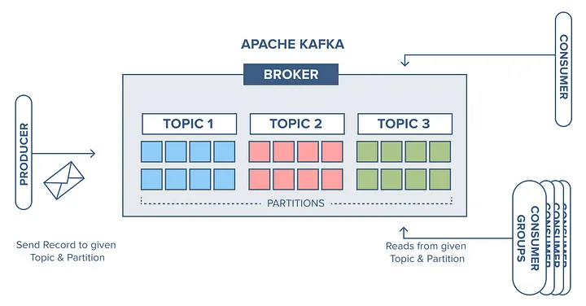

#  Kafka

---

> O Apache Kafka é uma plataforma de streaming de dados **open-source** e **distribuída**, usada para **coletar, processar e armazenar** grandes volumes de dados em tempo real. Imagine um rio de dados fluindo continuamente, o Kafka é a ponte que permite que você acesse e utilize esse fluxo de diversas maneiras.

---

---

## **Partições**

> - Uma partição é uma unidade de escala e tolerância a falhas no Kafka.
> - Cada tópico no Kafka é composto por uma ou mais partições.
> - As partições são sequências ordenadas e imutáveis de mensagens.
> - Elas permitem que os dados sejam distribuídos e paralelizados entre os nós do Kafka.
> - As mensagens em uma partição são ordenadas por seus offsets.
> - A ordem das mensagens é garantida apenas dentro de uma partição, não entre partições diferentes do mesmo tópico.

---

## **Offset**

> - Um offset é uma posição de uma mensagem dentro de uma partição.
> - Cada mensagem em uma partição tem um offset exclusivo.
> - Os offsets são atribuídos sequencialmente às mensagens à medida que são adicionadas à partição.
> - Eles são utilizados pelos consumidores para rastrear o progresso na leitura de mensagens de uma partição.
> - Os consumidores podem controlar de forma flexível o offset de leitura, permitindo que consumam mensagens desde o início da partição, a partir de um offset específico ou desde o offset mais recente.
> - Os offsets são mantidos pelo Kafka para cada consumidor de um tópico e são armazenados junto com o grupo de consumidores.

---

## Grupo

> *Um grupo de consumidores no Kafka é uma abstração que permite que várias instâncias de consumidores cooperem para consumir mensagens de um ou mais tópicos, proporcionando paralelismo, balanceamento de carga e controle de estado de consumo.*
>
> 1. **Coordenação**:
>    - Dentro de um grupo, um dos consumidores é designado como líder do grupo. Este líder é responsável por coordenar a atribuição de partições entre os membros do grupo.
>    - Quando novos consumidores se juntam ou saem do grupo, ou quando ocorrem reequilíbrios de partições, o líder do grupo coordena essas operações.
> 2. **Paralelismo**:
>    - O uso de grupos de consumidores permite o paralelismo na leitura de mensagens de um ou mais tópicos.
>    - Cada partição em um tópico só é consumida por um consumidor dentro de um grupo. Isso garante a ordem das mensagens dentro de uma partição.
>    - O número de partições em um tópico influencia o paralelismo que pode ser alcançado por um grupo de consumidores.
> 3. **Balanceamento de carga**:
>    - O líder do grupo de consumidores é responsável por distribuir as partições dos tópicos entre os consumidores do grupo de forma equitativa.
>    - Isso garante que cada consumidor dentro do grupo tenha aproximadamente a mesma carga de trabalho, evitando sobrecarga em alguns consumidores e subutilização em outros.
> 4. **Estado do consumidor**:
>    - O Kafka mantém o estado de consumo de cada grupo de consumidores, incluindo o offset de leitura para cada partição.
>    - Isso permite que os consumidores continuem de onde pararam em caso de reinicialização ou falha.

---

## Paralelismo (KEYS)

> As chaves (keys) em Kafka têm uma importância significativa para o paralelismo e o processamento distribuído dos dados. Aqui estão algumas razões pelas quais as chaves são importantes para o paralelismo no Kafka:
>
> 1. **Particionamento equilibrado**: As chaves são usadas para determinar em qual partição uma mensagem será armazenada. Isso permite que as mensagens relacionadas, identificadas pela mesma chave, sejam processadas pela mesma instância do consumidor. Esse particionamento equilibrado distribui a carga de processamento entre os consumidores, permitindo um processamento paralelo eficiente.
> 2. **Ordenação garantida por chave**: Se as mensagens têm chaves relacionadas, o Kafka garante que todas as mensagens com a mesma chave sejam enviadas para a mesma partição, mantendo a ordem de chegada. Isso é útil em cenários em que a ordem das mensagens é crucial para o processamento adequado dos dados.
> 3. **Escalabilidade horizontal**: O uso de chaves permite adicionar mais partições ao tópico do Kafka conforme necessário, para lidar com um maior volume de dados ou para aumentar a capacidade de processamento. Com mais partições, é possível distribuir ainda mais as mensagens entre os consumidores, aumentando o paralelismo e a capacidade de processamento.
> 4. **Paralelismo de processamento**: Ao distribuir as mensagens com base nas chaves, várias instâncias de consumidores podem processar as mensagens em paralelo. Isso permite que o processamento de dados seja escalável e eficiente, aproveitando ao máximo os recursos disponíveis
