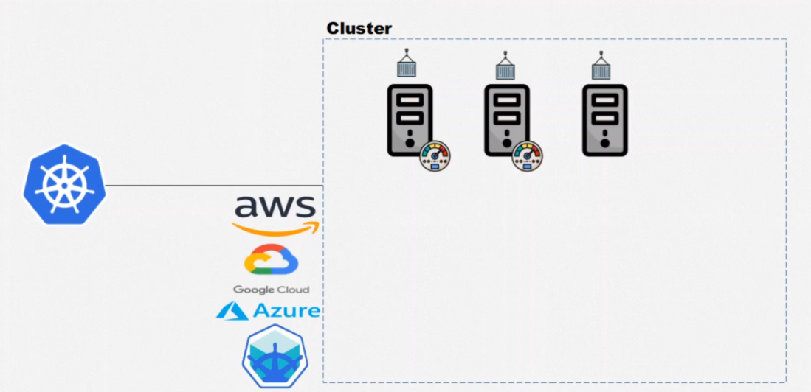
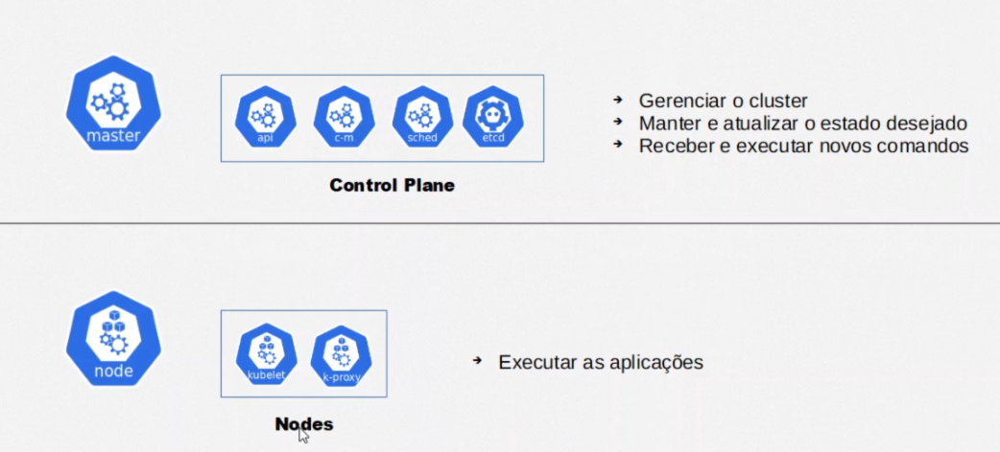

# Kubernetes

> Kubernetes é um sistema de orquestração de contêineres open-source que automatiza a implantação, o dimensionamento e a gestão de aplicações em contêineres.
>
> 

----

## Arquitetura do Kubernetes

> As maquinas dentro de um cluster sao demominadas de duas formas difrentes:
>
> 
>
> ### A Api 'e responsavel por manter a comunicacao entre todos esses componentes:
>
> 
>
> 

