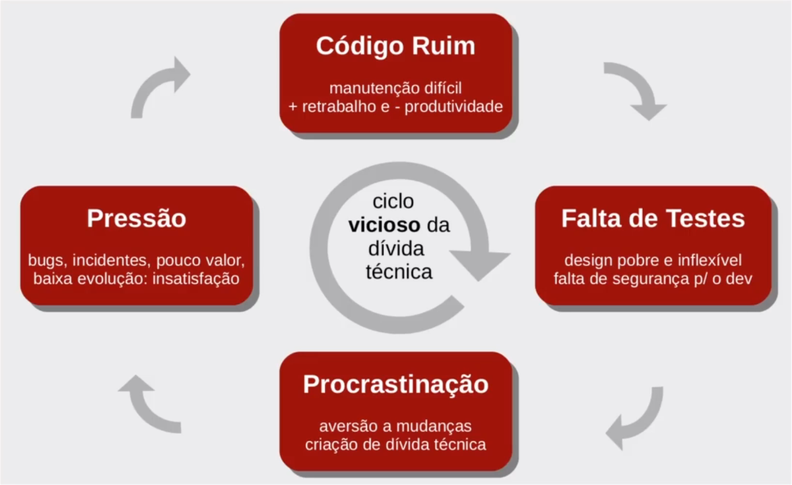

# Clean code

------

## Ciclos

> ### Ciclo vicioso da dívida técnica:
>
> ### 
>
> ----
>
> ### Ciclo da eficácia no software sob medida:
>
> 
>
> *fontes:* 
>
> - https://artesoftware.com.br/2019/02/10/divida-tecnica/
> - https://artesoftware.com.br/2019/02/10/tratando-divida-tecnica-5-etapas/
> - https://artesoftware.com.br/2019/02/10/escala-estol-6-estagios-divida-tecnica/

---

## Filosofia "Clean code"

> A filosofia do "Clean Code" (Código Limpo) é uma abordagem de desenvolvimento de software que enfatiza a escrita de código compreensível, legível e de fácil manutenção. Resumidamente, as principais ideias por trás do Clean Code incluem:
>
> 1. **Clareza e Simplicidade:** Escrever código de forma simples e direta para que qualquer pessoa possa entender o que ele faz. Use nomes descritivos para variáveis, funções e classes.
> 2. **Pequenas Funções:** Divida o código em funções pequenas e focadas em tarefas específicas. Cada função deve fazer uma coisa e fazê-la bem.
> 3. **Evitar Duplicação:** Não repita código. Use abstrações e funções reutilizáveis para evitar duplicação de lógica.
> 4. **Comentários Significativos:** Utilize comentários quando necessário para explicar o porquê de um código ou abordagem específica. No entanto, o código em si deve ser autoexplicativo na medida do possível.
> 5. **Testes Unitários:** Escreva testes unitários para garantir que o código funcione conforme o esperado. Os testes devem ser parte integrante do desenvolvimento.
> 6. **Manutenção Constante:** Mantenha o código atualizado e refatore-o regularmente para melhorar sua qualidade e legibilidade. O código limpo é um processo contínuo.
> 7. **Código de Equipe:** Codifique como se estivesse escrevendo para uma audiência. Lembre-se de que outros desenvolvedores, incluindo você no futuro, precisarão entender e manter o código.
> 8. **Princípio DRY (Don't Repeat Yourself):** Evite duplicação de código. Se você encontrar uma lógica ou funcionalidade semelhante em várias partes do código, abstrai-a para uma função ou classe reutilizável.
> 9. **Princípio SRP (Single Responsibility Principle):** Cada classe ou função deve ter uma única responsabilidade. Evite criar entidades que fazem muitas coisas diferentes.
> 10. **Princípio KISS (Keep It Simple, Stupid):** Mantenha as coisas simples. Evite soluções complexas quando soluções mais simples funcionarem igualmente bem.
>
> *fonte:* https://artesoftware.com.br/2020/08/02/clean-code/
